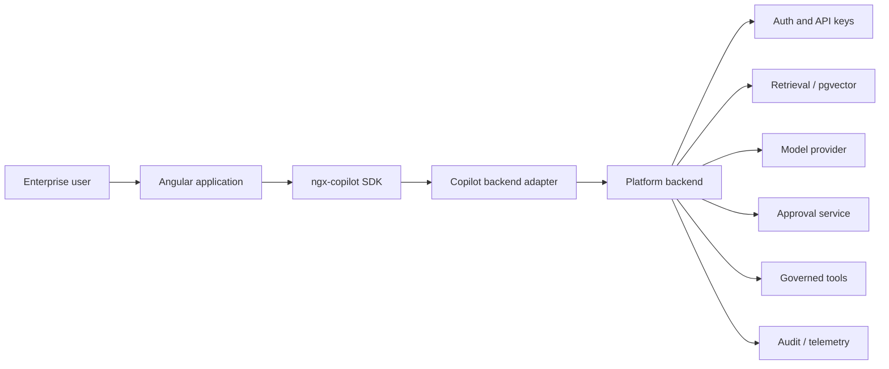
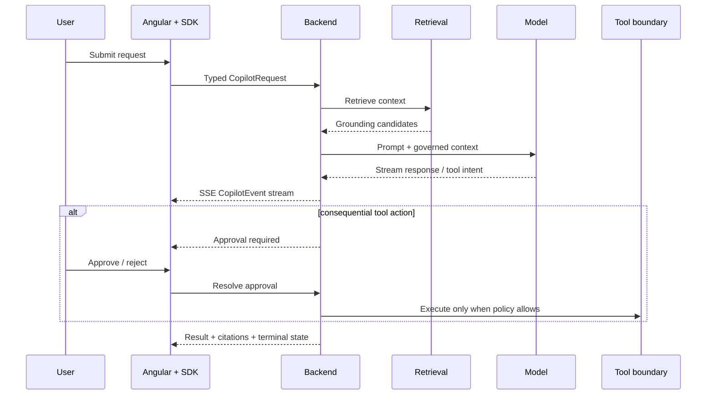

# Architecture Review — ngx-copilot-platform

This document is the fastest technical review path for architects, staff engineers, hiring managers, and contributors evaluating `ngx-copilot-platform`.

## Architectural role

`ngx-copilot-platform` is the flagship **AI frontend platform** in the AnkitParekh007 open-source portfolio. Its central boundary is deliberate: Angular owns product interaction; the backend owns credentials, retrieval, policy, execution and audit.

## System context



## Runtime flow



## Trust boundary

```text
Browser / Angular
  - public runtime configuration only
  - no model provider secrets
  - no service-role credentials
  - renders citations, tool state and approvals
          |
          v
Platform backend
  - authentication and API-key policy
  - retrieval and ingestion
  - provider credentials
  - approval resolution
  - tool allow/deny decisions
          |
          v
External systems
  - model providers
  - Supabase/Postgres/pgvector
  - future production tool executors
```

The browser is intentionally a thin, typed interaction client rather than a policy enforcement point.

## Failure architecture

| Failure | Required behavior |
| --- | --- |
| SSE disconnect | Preserve terminally known UI state; reconnect/retry without inventing completed work |
| Retrieval failure | Surface an ungrounded/error state rather than fabricate citations |
| Provider timeout | Return retryable failure metadata and preserve request context |
| Invalid/expired API key | Fail before provider or retrieval execution |
| Approval rejected | Record rejection and do not execute the protected action |
| Tool unavailable | Return an explicit disabled/not-implemented state; never pretend execution occurred |
| Stale client state | Backend remains source of truth for authorization and approval resolution |

## Implemented / demo / planned boundary

### Implemented architecture

- publishable Angular SDK boundary
- typed request/response/event contracts
- backend auth and API-key lifecycle
- RAG/retrieval boundary
- SSE streaming contract
- approval resolution contract
- CI and package/release workflows

### Demo or development surfaces

- repository demo/example applications
- mock adapter paths used for component development

### Intentionally incomplete

- production browser automation executor remains disabled until a real governed executor exists
- public production deployment requires environment-specific CORS, migrations, runtime configuration and release validation

## Architect review checklist

- [ ] Can a browser obtain a provider or service-role secret? It should not.
- [ ] Are answers distinguishable from citations and tool results?
- [ ] Are consequential actions gated by explicit approval?
- [ ] Can disabled capabilities fail closed?
- [ ] Are API contracts typed and independently testable?
- [ ] Can SDK UI development run without production credentials?
- [ ] Are production and demo surfaces clearly separated?

## Related portfolio projects

- [`frontend-ai-patterns`](https://github.com/AnkitParekh007/frontend-ai-patterns) — reusable interaction contracts and trust patterns.
- [`angular-ai-copilot-starter`](https://github.com/AnkitParekh007/angular-ai-copilot-starter) — smaller runnable Angular UX reference.
- [`agent-studio`](https://github.com/AnkitParekh007/agent-studio) — governed agent application lifecycle and runtimes.
- [`org-ai-force`](https://github.com/AnkitParekh007/org-ai-force) — enterprise multi-agent workspace architecture.
