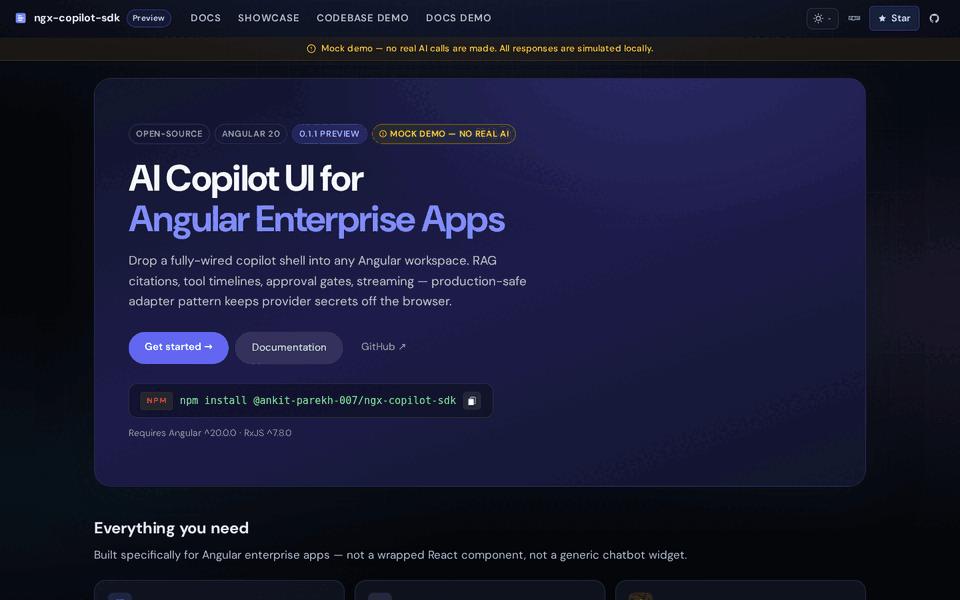

# Public Proof Review Path

`ngx-copilot-platform` is the flagship full-stack Angular AI platform in this portfolio. The fastest way to evaluate it is to review both the happy-path product surface and the explicit failure/recovery boundary between the Angular SDK and the backend.

## 30-second review



The animation is generated from the exact branch build at a 1440×900 recruiter viewport. It shows the reusable platform surface and deterministic failure-contract states without implying live provider, retrieval, or tool incidents.

Open:

1. [Live demo](https://ankitparekh007.github.io/ngx-copilot-platform/)
2. [Failure lab](https://ankitparekh007.github.io/ngx-copilot-platform/failure-lab)
3. [npm package](https://www.npmjs.com/package/@ankit-parekh-007/ngx-copilot-sdk)

The platform should communicate three things immediately:

- Angular owns typed interaction state and rendering.
- The backend owns authentication, secrets, retrieval, policy, approvals, execution, and audit boundaries.
- Failure states remain inspectable instead of being silently converted into success.

## 3-minute review

Use the demo and failure lab to inspect:

| Scenario | Public contract being proved |
| --- | --- |
| Happy-path stream | `CopilotEvent` can drive incremental Angular UI state |
| Retrieval failure | no source event means no fabricated citation surface |
| Approval rejection | rejected approval is terminal and non-executed |
| Disabled tool | policy-disabled execution remains visible as skipped/non-executed |
| Recoverable disconnect | adapter error is explicit and retry preserves request context |
| Backend failure | server responses carry semantic failure information instead of generic success |

The failure lab is deterministic and does not require model, RAG, or tool credentials.

## 15-minute code review

Inspect these boundaries:

- `packages/sdk/src/` — Angular SDK public contracts and rendering primitives
- `apps/demo-app/src/app/failure-lab/` — deterministic SDK-contract failure scenarios
- `packages/backend/src/` — authenticated platform boundary
- backend failure-contract tests
- `apps/admin-ui/` — API-key/admin lifecycle surfaces
- `apps/example-consumer/` — production-shaped external consumer
- `docs/adr/` — architecture decisions and tradeoffs

Then run the repository quality gates:

```bash
pnpm install --frozen-lockfile
pnpm --filter @ankit-parekh-007/ngx-copilot-sdk build
pnpm --filter @ankit-parekh-007/ngx-copilot-sdk lint
pnpm --filter @ankit-parekh-007/ngx-copilot-sdk test:coverage
pnpm --filter demo-app test -- --watch=false --browsers=ChromeHeadless
pnpm --filter demo-app build
pnpm --filter admin-ui build
pnpm --filter @ngx-copilot/backend typecheck
pnpm --filter @ngx-copilot/backend test
pnpm --filter example-consumer build
pnpm --filter @ngx-copilot/backend build
```

## Evidence matrix

| Layer | Evidence |
| --- | --- |
| Angular integration | packaged SDK + example consumer |
| Streaming | typed SSE event contract |
| Retrieval | RAG result contract and citation surfaces |
| Tool visibility | typed tool timeline events |
| Human approval | approval request/resolution contract |
| Failure semantics | `CopilotAdapterError` and backend semantic failures |
| Retry | recoverable disconnect scenario with retained request context |
| Security boundary | provider credentials and execution policy remain backend-owned |
| Distribution | npm dry-run/publish workflow and package boundary |
| CI | SDK, demo, admin, backend, and example-consumer validation |

## Recruiter demo sequence

For a short recording or live walkthrough:

1. open the main showcase and explain the Angular SDK boundary;
2. show streaming + sources + tool timeline + approval;
3. open `/failure-lab`;
4. trigger retrieval failure and point out that citations/tool planning disappear;
5. trigger approval rejection and point out that execution never becomes successful;
6. trigger the recoverable disconnect and show retry with the same safe request context;
7. finish on the architecture diagram or npm package to show this is a reusable platform, not a one-off screen.

## Ecosystem path

This repository is the **full-stack platform** layer:

[AI Tools Cheatsheets](https://github.com/AnkitParekh007/ai-tools-cheatsheets) → [Frontend AI Patterns](https://github.com/AnkitParekh007/frontend-ai-patterns) → [Angular AI Copilot Starter](https://github.com/AnkitParekh007/angular-ai-copilot-starter) → **ngx-copilot-platform** → [Agent Studio](https://github.com/AnkitParekh007/agent-studio) → [Org AI Force](https://github.com/AnkitParekh007/org-ai-force)

**Learn → Pattern → Run → Platform → Govern → Operate**
