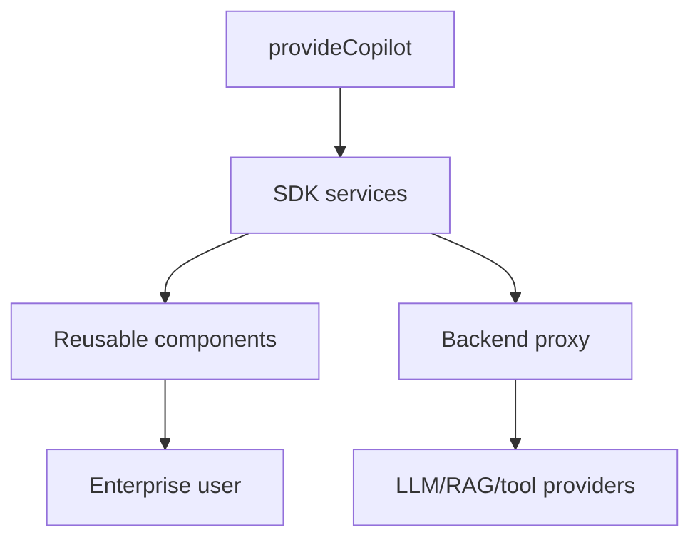

# Architecture

The SDK is organized around a small set of reusable Angular contracts:

- `provideCopilot` configures API base URL, default mode, approvals, RAG sources, and tool timeline behavior.
- `ContextProviderService` serializes route, role, tenant, selected record, and safe metadata.
- `ToolRegistryService` registers frontend-visible tool definitions while execution remains backend-governed.
- `RagAdapterService` normalizes retrieved sources into UI-ready citation cards.
- `StreamingAdapterService` models token/chunk streaming for chat UI.

